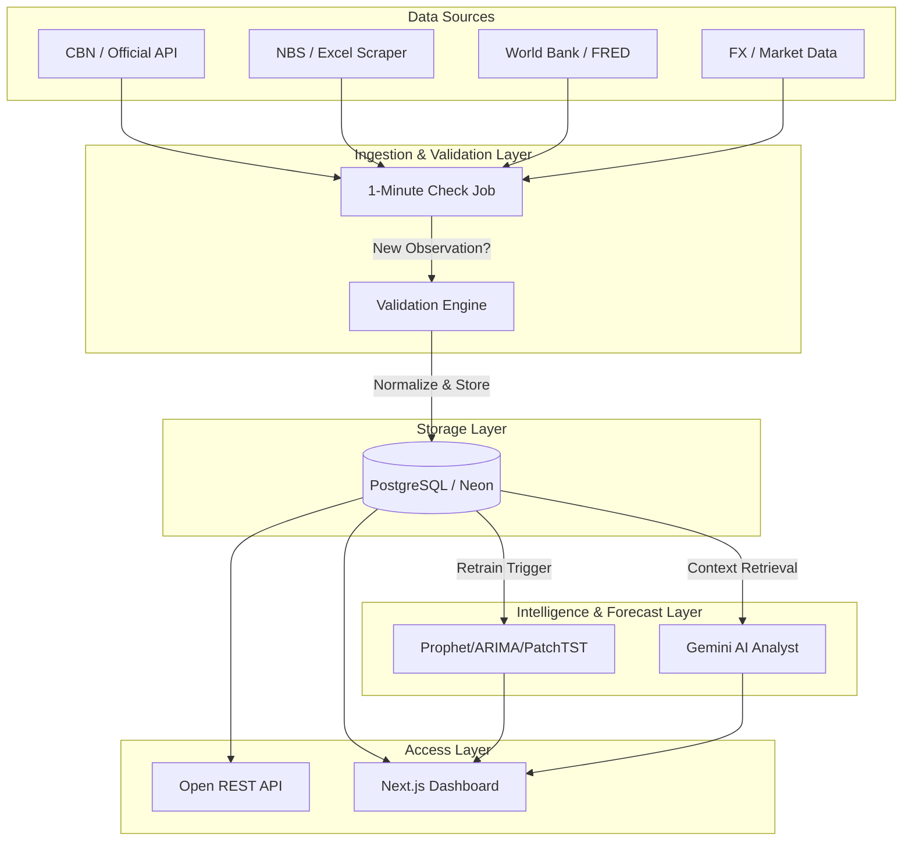

# Architecture — EconoNigeria 2.0

## System Overview

EconoNigeria 2.0 transitions from a static dashboard to a near-real-time open economic data infrastructure. It separates high-frequency ingestion checks from low-frequency analytical workloads, ensuring accurate provenance and avoiding fabricated minute-by-minute data points for inherently slow-moving macroeconomic indicators.

## The Economic Data Layer

The core of EconoNigeria 2.0 is the **Economic Data Layer**, which enforces a strict pipeline:

1. **SOURCE**: External APIs, CSVs, or web scrapers.
2. **INGESTION**: 1-minute cron jobs monitor eligible sources for updates.
3. **VALIDATION**: Data is checked for outliers, missing values, and unit consistency.
4. **NORMALIZATION**: Data is mapped to standard indicator codes.
5. **ECONOMIC DATABASE**: Stored with strict provenance metadata.

### Provenance Tracking
To maintain trust and support research reproducibility, every data point tracks:
- `source_checked_time`: When the job last checked the source.
- `observation_time`: The period the data describes (e.g., Q1 2026).
- `publication_time`: When the data was originally published.
- `ingestion_time`: When it entered EconoNigeria.

## Real-Time Ingestion Strategy

EconoNigeria targets a **one-minute monitoring cadence**, but respects the **native frequency** of each indicator.

* **High-Frequency (e.g., FX, Market Rates):** Checked every minute. If changed, new observation ingested.
* **Low-Frequency (e.g., GDP, Inflation):** Checked periodically (daily/weekly) depending on the source's update schedule. We **never** fabricate minute-by-minute values for monthly data.

## Forecast Engine (Decoupled)

Forecasts are **not** generated every minute. They are computationally expensive.
Instead, when a low-frequency macro indicator (like GDP) registers a new official observation, an event triggers the retraining and re-evaluation of the forecasting models (Prophet, ARIMA, XGBoost).

## Tech Stack 2.0

| Layer | Technology |
|---|---|
| **Frontend** | Next.js 15 (App Router), TypeScript, TailwindCSS, Shadcn UI, Recharts |
| **Backend / API** | FastAPI, Python 3.12, SQLAlchemy, Pydantic |
| **Database** | PostgreSQL (Neon.tech) |
| **Forecasting** | Prophet, ARIMA, XGBoost, Pandas |
| **Intelligence** | Gemini API |
| **Hosting** | Vercel (Frontend), Render (Backend), Docker |
